
<h1 align="center">基于的影城会员管理系统</h1>

## 简介
影城会员管理系统：角色分为管理员、用户；功能包括会员注册和登录、电影信息和影票管理、商品搜索与积分兑换、个人中心管理和数据统计分析。系统基于Spring Boot开发，提升影城管理和用户体验。    --计算机毕业设计源码；毕设源码；java毕业设计源码

## 联系方式

<h3 align="center">获取完整代码与数据库文件 + 微信：deepguan QQ: 86050149 QQ群: 783742310</h3>

<h3 align="center">可帮忙远程部署 包运行成功！提供远程部署、修改代码、设计文档指导、代码讲解等服务！</h3>

## 功能介绍（完整见运行截图）
管理员：登录、注册、退出功能。可以通过侧边栏模块进行会员、电影分类、影片信息、订单和影院商品信息的管理。在订单管理和商品管理页面可查看详细信息并进行相关操作。页面设计简洁清晰，提供关于我们模块的查看和修改。会员信息查询、数据统计和管理等功能有效提升服务效率。  
用户：支持注册、登录，浏览电影信息和影院商品，按分类、关键词进行高级搜索。个人中心显示个人信息、订单和收藏，提供信息的查看和编辑功能。用户可在电影界面查看详细信息并进行电影票预订。支持会员充值和等级查询，同时提供热门推荐和用于积分兑换的商品展示。登录界面简洁，科技风格背景增强体验。

## 运行截图

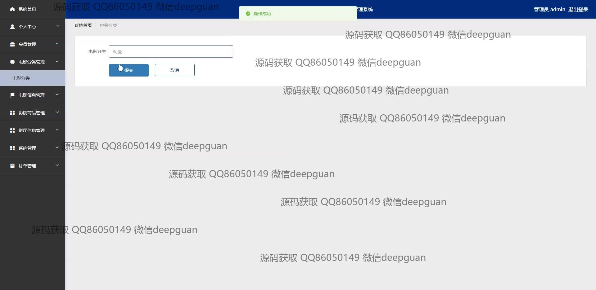
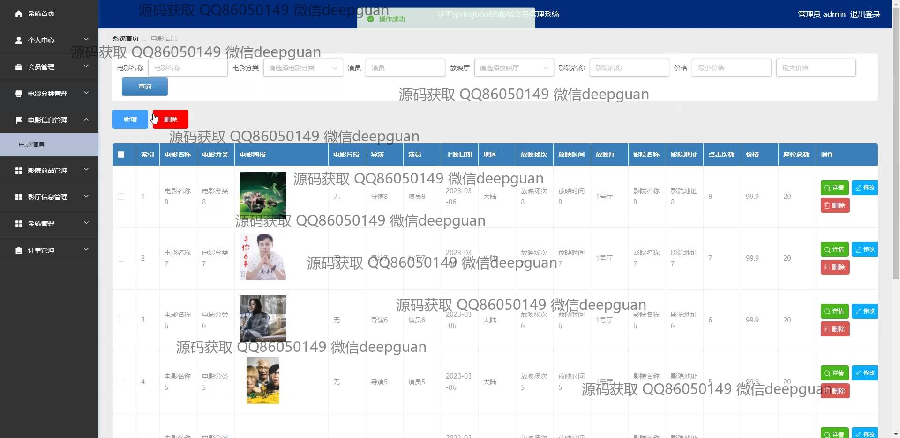

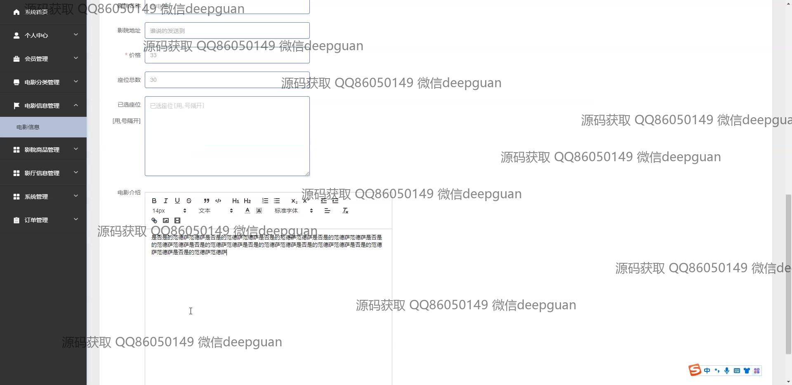
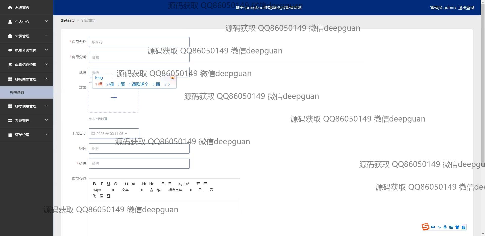
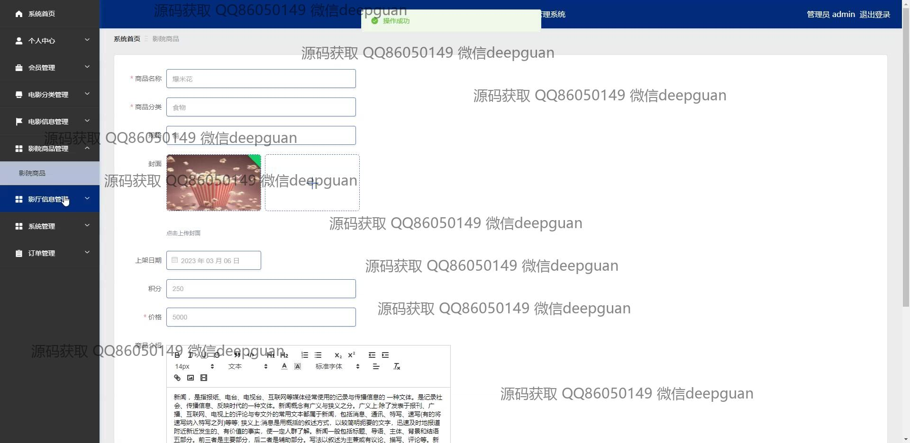

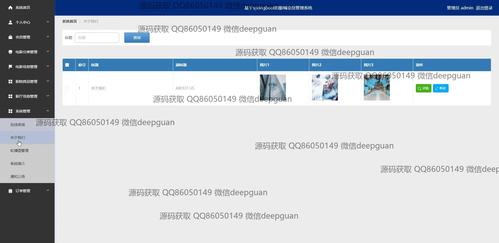

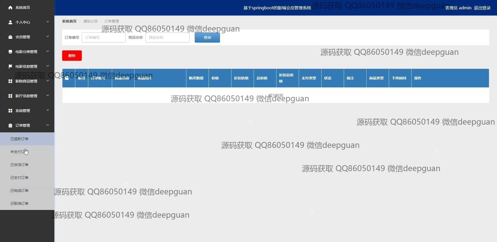

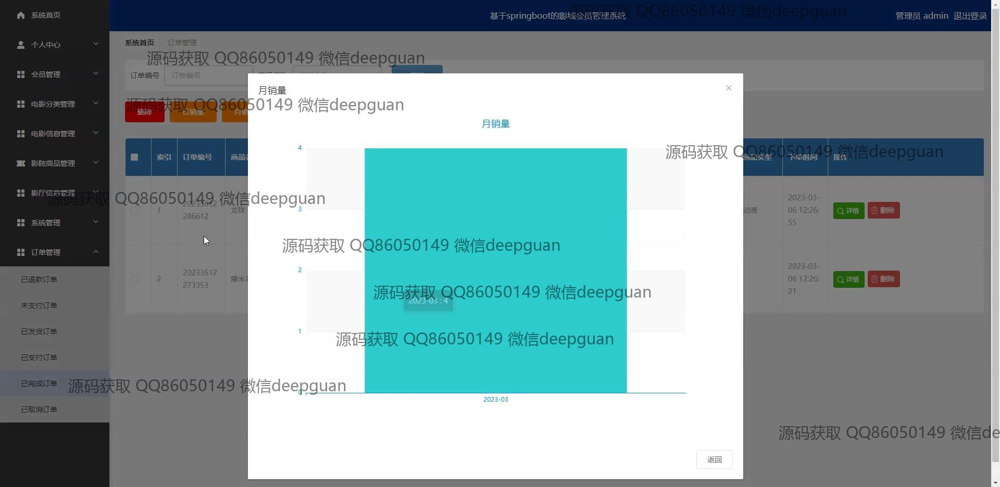

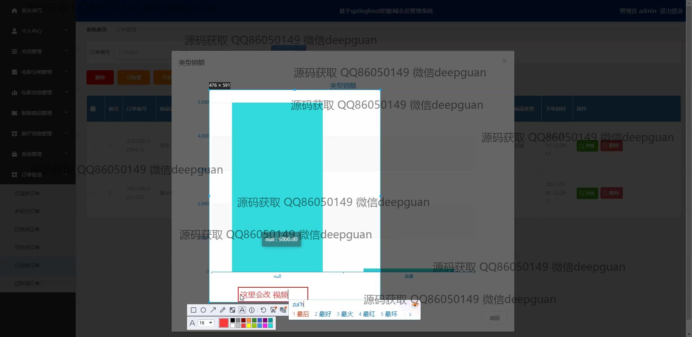

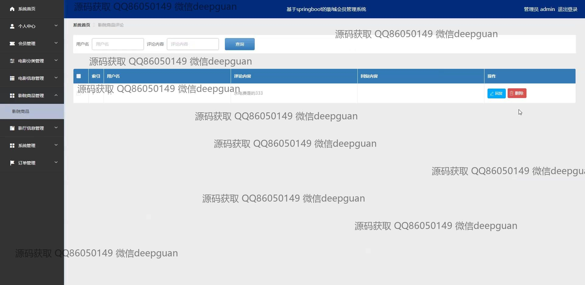

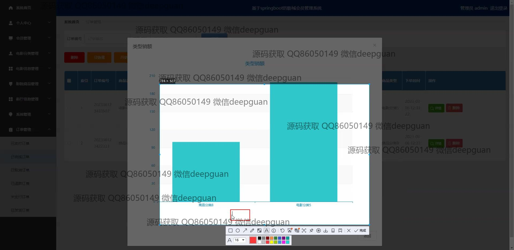

本代码来源于网络,仅供学习参考使用!

